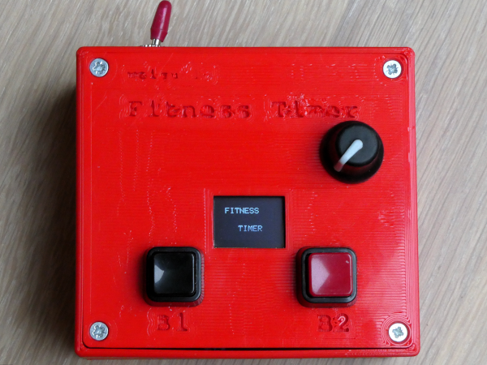
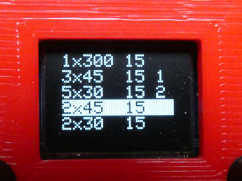

# Fitness Timer: Do your fitness :)



## All infos on: <http://www.weigu.lu/microcontroller/fitness_timer/index.html>

## Some infos

Three tones are generated. The first darker tone starts the exercise. After e.g. 45&#8239;s a brighter tone indicates that the repeat is finished. After a pause (e.g. 15&#8239;s), the next repeat is done. After x (e.g. 3) repeats a triple tone indicates the end of the exercise.

The display shows this exercise with:

```
    3x45 15 1
```

[](png/fitness_timer_display.png)

We have two buttons to choose between 2 programs. Different programs can be assigned to the buttons with the help of an encoder with push-button.
For this we push the rotary encoder, choose the program by rotating, press the button we need (B1 or B2) and push the encoder again.

If we push a button this program starts after 5&#8239;s to allow us to get in position.

We also have a default program that starts when switching on. It is a one time 5 minutes program to calm down and breath, before beginning with the exercises. The programs can be adjusted in code.

### BOM

+ [LOLIN/WEMOS D1 mini Pro (V2.0)](https://www.wemos.cc/en/latest/d1/d1_mini_pro.html)
+ [D1 mini 0.66" OLED shield with 2 I²C buttons (V2.1)](https://www.wemos.cc/en/latest/d1_mini_shield/oled_0_66.html)
+ rotary encoder with push-button
+ 2 push-buttons (12&#8239;mm)
+ 1 switch (6&#8239;mm)
+ 1 piezo speaker (30&#8239;mm)

### Circuit and housing

There was no need for a PCB. The housing is designed with FreeCAD.


